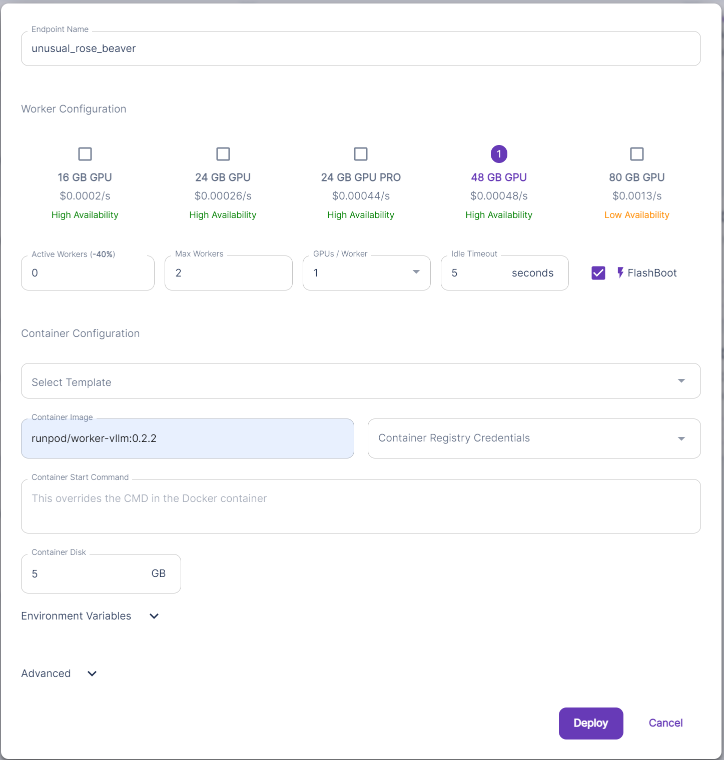
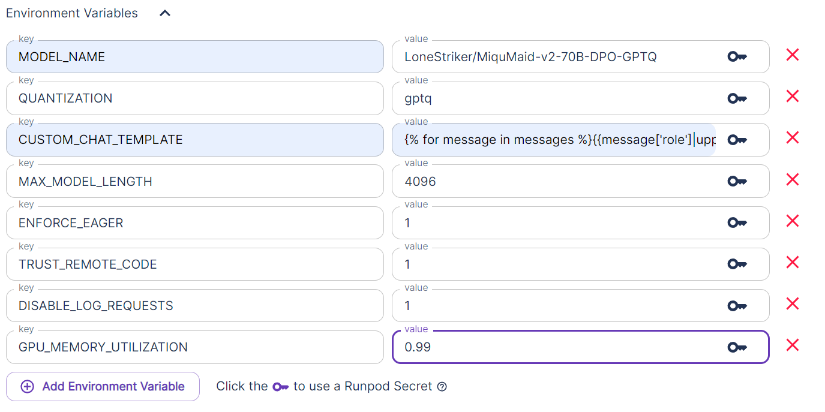
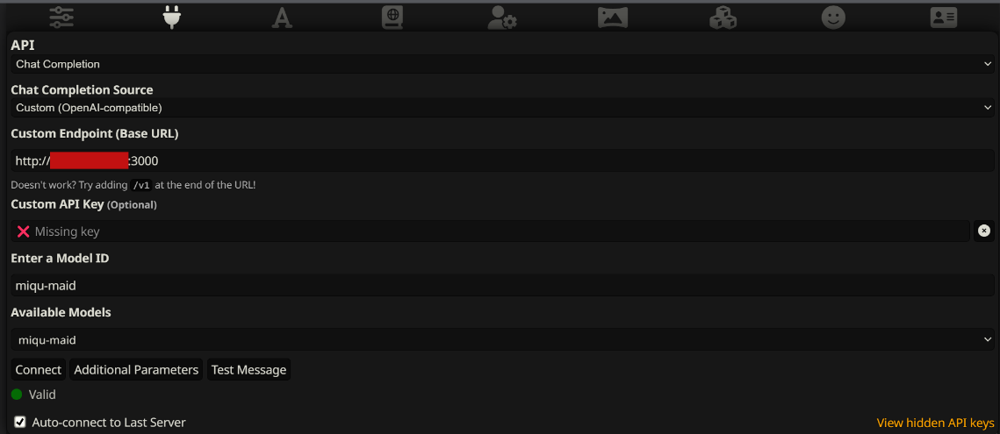
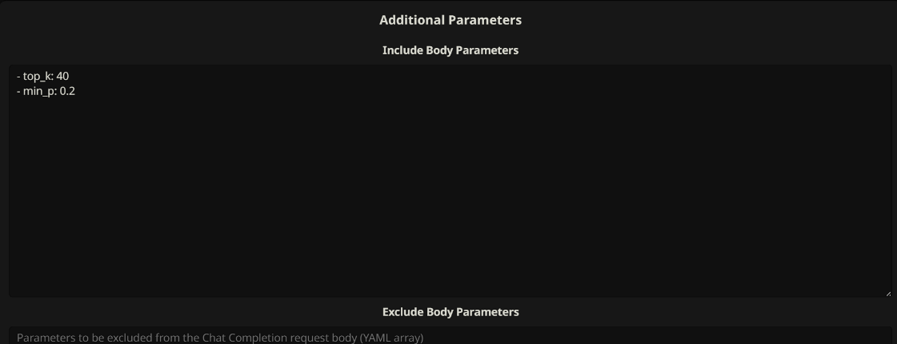
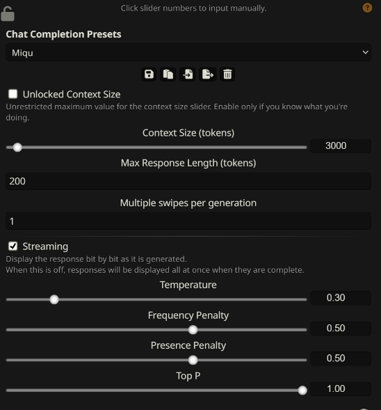
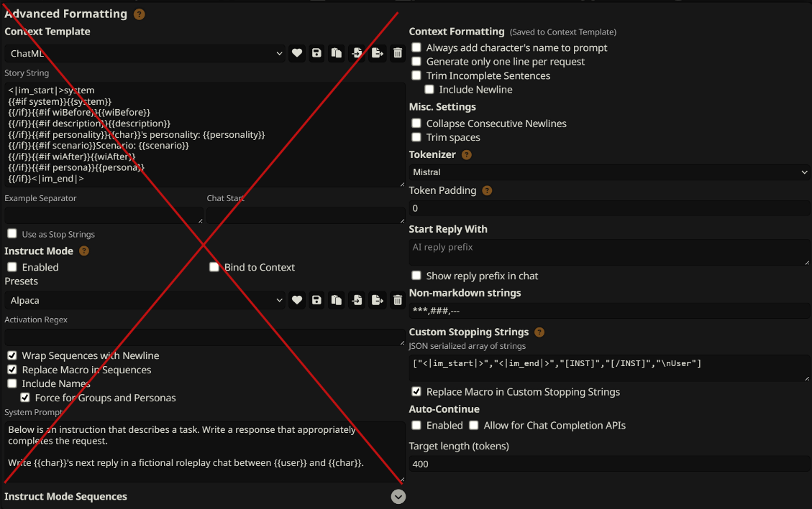

# Guide for Creating a Serverless LLM Endpoint for MiquMaid-v2-70B-DPO-GPTQ

This guide will help you create a serverless LLM endpoint for the Hugging Face model at [LoneStriker/MiquMaid-v2-70B-DPO-GPTQ](https://huggingface.co/LoneStriker/MiquMaid-v2-70B-DPO-GPTQ).

**Note**: There is a difference in how ST and vLLM calculate tokens that I can't figure out how to resolve. Setting the context to anything higher than 3000 will crash this model.

## Pre-download Model

Follow the instructions provided in [hf-pre-downloader](./hf_pre_downloader.md) guide to load the model in the network volume before creating the endpoint. This will save on execution time.

I use a network volume with a size of `45 gb`.

## Endpoint Configuration 





Here are the template configuration values:

| Parameter | Value |
|-----------|-------|
| `MODEL_NAME` | `LoneStriker/MiquMaid-v2-70B-DPO-GPTQ` |
| `QUANTIZATION` | `gptq` |
| `CUSTOM_CHAT_TEMPLATE` | See code block below |
| `MAX_MODEL_LENGTH` | `4096` |
| `ENFORCE_EAGER` | `1` |
| `TRUST_REMOTE_CODE` | `1` |
| `DISABLE_LOG_REQUESTS` | `1` |
| `GPU_MEMORY_UTILIZATION` | `0.99` |

Chat template:
```markdown
{{message['role']|upper + ':' + '\n' + message['content'] + '\n'}}\nASSISTANT:\n
```

## Server Configuration

`config.json`:
```json
{
"api_key": "MY_API_KEY",
"models": [
    {
        "endpoint": "iy67fkfbebcw6p",
        "model": "miqu-maid",
        "batch_size": 8,
        "timeout": 60
    },
    {
        "endpoint": "xnswc66gg6xvzr",
        "model": "goliath",
        "batch_size": 8,
        "timeout": 60
    }
]}
```

The command I use to run the server from the root directory of the repository:
```bash
python main.py --config ./config.json
```


## SillyTavern Configuration

The following screenshots are all of the settings I use for these models.

Additional Parameters yaml:
```yaml
- top_k: 40
- min_p: 0.2
```










