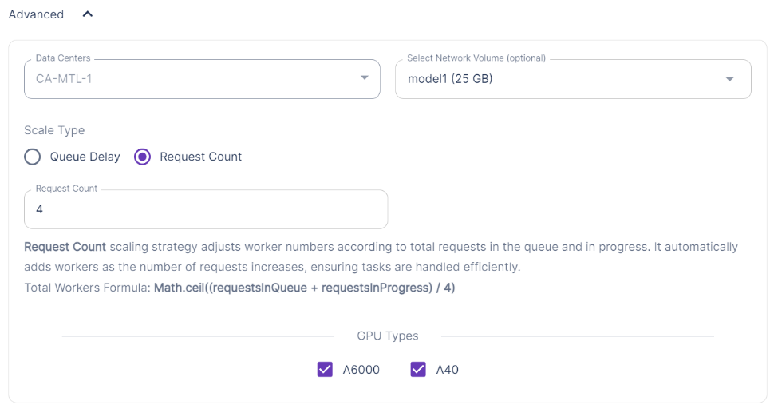
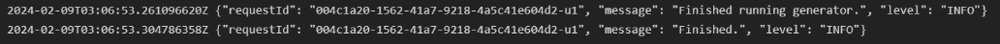

# Runpod Serverless Endpoint Setup Guide

This guide will walk you through the process of setting up a Runpod Serverless endpoint.

# Disclaimer

Please be aware that this application uses cloud resources which may incur costs. These costs are dependent on the usage and the pricing model of the cloud service provider. 

By using this application, you acknowledge that you are fully responsible for any costs that may arise from its operation. As the developer of this application, I am not responsible for any charges you may incur while running this application.

## Table of Contents

- [Obtain an API Key](#step-1-obtain-an-api-key)
- [Create a Network Volume (Optional)](#step-2-create-a-network-volume-optional)
- [Create an Endpoint](#step-3-create-an-endpoint)
- [Test the Endpoint and Observe Logs](#step-4-test-the-endpoint-and-observe-logs)
- [References](#references)

## Step 1: Obtain an API Key

To use [Runpod's](https://runpod.io) services, you'll need an API key. If you don't already have one, you can obtain it by:

1. Register for an account if you don't already have one.
2. Navigate to the [API section](https://www.runpod.io/console/user/settings).
3. Generate a new API key.

Remember to keep your API key secure and do not share it with anyone.

## Step 2: Create a Network Volume (Optional)

Creating a network volume is optional but strongly encouraged for better data management and performance.

1. Navigate to the [Storage](https://www.runpod.io/console/user/storage) section on the Runpod platform.
2. Choose a region for the volume. This restricts which region your serverless endpoint will use, so pay attention to the available hardware listed in the menu.
3. Follow the instructions to create a new volume.

Important: Before setting up the volume, ensure you are aware of the size of the model you plan to install. This information is crucial to allocate appropriate storage capacity.

## Step 3: Create an Endpoint

1. Navigate to the [Serverless](https://www.runpod.io/console/serverless) section on the Runpod platform and click the *New Endpoint* button.
2. The following menu contains a lot of important settings so I will go over them individually.

3. These are the settings I commonly use for my endpoints.
    - Assign a memorable name to the endpoint. This will make it easier to find your settings and use them as a template for future endpoints.
    - Ensure that the hardware configuration matches what is available in the region you selected for your network volume.
    - Even though I have scaling set up to rarely exceed 1, I typically set Max Workers to 2. This prompts the platform to initialize multiple workers for your endpoint. Since charges only apply when workers are executing, having multiple initialized workers can help maintain endpoint accessibility during high-traffic periods on the platform in that region.
    - The tooltip for Idle timeout indicates that charges apply during idle time before the worker goes to sleep. Setting this to 1 (the lowest value allowed) will limit the amount of time that a worker is active to its minimum. I set it to 1, but if you are making frequent requests then you may benefit from a higher value.
    - FlashBoot is the key feature here and should always be enabled. If the platform doesn't recycle the worker before you access it again, it restarts almost instantly, ready for inferencing.
    - This app is designed to work with the `runpod/worker-vllm:0.2.3` container.
    - The default 5GB of container disk space has been sufficient for me, provided that I have a network volume attached.

4. Next are the environment variables that will be passed to the worker container doing the actual inferencing. This is a screenshot of settings I typically use. You can find a list of all available variables at the [runpod/worker-vllm repo](https://github.com/runpod-workers/worker-vllm)
    - `MODEL_NAME` is required and should refer to a model on [HuggingFace](https://huggingface.co/). `MODEL_REVISION` is also available if your model has multiple revisions.
    - `QUANTIZATION` should be set to the method your model uses. If you are not using a quantized model, omit this setting. I have had more luck with `gptq` models than `awq`.
    - `CUSTOM_CHAT_TEMPLATE` is necessary if you want to send the api messages and receive a chat completion object, but your model doesn't have a default template or your messages don't conform to the default template. I've noticed that many of the default settings either don't apply well to the model or are overly strict. I have included some examples that I use in [Chat Templates](../chat_templates.jinja2). For a lot of the more popular models you won't need this setting.
    - `TRUST_REMOTE_CODE` is required by some models. If the model instructions don't specify that you need it, or if you don't encounter an error related to this setting, then omit it.
    - `MAX_MODEL_LENGTH` is another setting that you usually won't need to use. Most models have a reasonable max_model_length, which vllm typically loads without issues. This particular example has a very large max_model_length and doesn't work with the hardware I have chosen unless I limit it.
    - `GPU_MEMORY_UTILIZATION` is necessary a lot of times if you are working with a large model. vllm tries to reserve most (`0.98` by default) of the available vram when it starts up. There are some other processes that need access to vram though. If you receive errors related to memory usage, and this setting is specifically mentioned, consider setting it to a lower value. May take some tweaking to get it right.
    - `WORKER_CUDA_VERSION` the default for this setting is `11.8.0`. In my experience, setting it to `12.1.0` provides a performance boost. However, according to the description on the worker-vllm repo, this may somewhat limit your pool of available resources. I always set it to `12.1.0`.
    - You can choose to `DISABLE_LOG_REQUESTS` if you want. The documentation doesn't clearly specify what is done with these logs, and I didn't extensively search for this information.

5. This is the last section of settings for the endpoint.
    - Here I attach my network volume to the endpoint (which automatically restricts the region to match the volume).
    - I also change the scaling settings from `Queue Delay` to `Request Count` and then leave the rest alone. Since I don't require scaling and I won't be sending more than 4 concurrent requests, this setting should maintain my number of active workers at 1.

Click *Create* and head over to the endpoint details screen.

## Step 4: Test the Endpoint and Observe Logs

After creating the endpoint, it's important to test it to ensure it's working correctly. This step is crucial.If the endpoint is not configured correctly, it could potentially remain active indefinitely, caught in an error loop. That gets expensive fast. So always run the test payload on the *Requests* tab of the endpoint details screen and wait for a worker to complete it successfully. Observe the worker logs and when you see something like the following screenshot then your endpoint should be ready to connect to the api.

The first time a job gets processed on your endpoint, the worker has to download the model files, so it could take a few minutes. However, as long as you have a network volume attached, these files should not need to be downloaded again.

Please see the reference below for more detailed information on anything covered in this guide.

## References

- [Runpod API Documentation](https://docs.runpod.io/serverless/references/endpoint-configurations): Detailed documentation for the Runpod API.
- [Runpod/worker-vllm Repository](https://github.com/runpod-workers/worker-vllm): The GitHub repository for the Runpod worker-vllm project.
- [VLLM Repository](https://github.com/vllm-project/vllm): The GitHub repository for the VLLM project.
